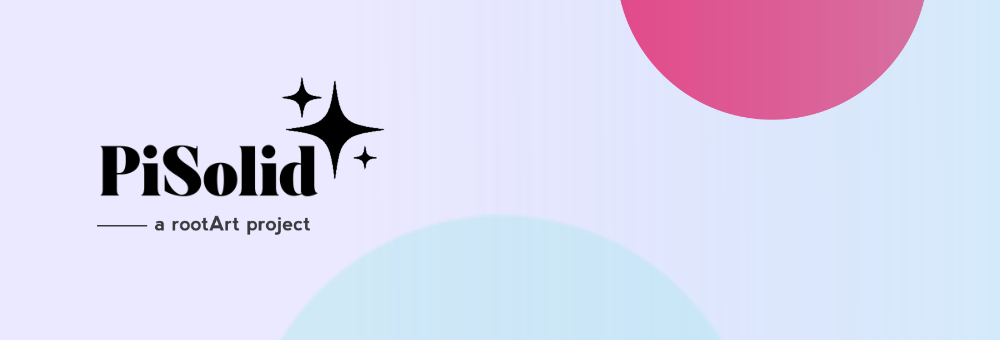

# PiSolid: aumenta la seguridad en internet.

## ¿En qué consiste?

Este proyecto consta de una serie de dominios bloqueados que fueron considerados inapropiados o inseguros.

El enfoque de este proyecto es específico para Latinoamérica, ya que muchos proyectos similares están orientados internacionalmente y suelen omitir dominios relevantes para esta región. Este proyecto busca llenar ese vacío y mejorar la seguridad en la navegación para usuarios latinoamericanos.

## Contenido bloqueado
- Criptomonedas.
- Drogas.
- Estafas.
- Fake news.
- Malware.
- Phishing.

## ¿Cómo se utiliza?

El formato de bloqueo de dominios en AdBlock permite filtrar contenido al bloquear dominios específicos y, por ende, sus subdominios asociados de manera efectiva. Esta técnica es compatible con una amplia gama de softwares y herramientas de filtrado de anuncios, incluyendo Pi-Hole, AdGuard, AdGuard Home, y Technitium, entre otros. Además, este formato se puede utilizar en navegadores que admiten listas de bloqueo basadas en el formato AdBlock, como en las extensiones AdBlock o uBlock Origin.

Para que estos softwares o extensiones puedan aplicar correctamente las reglas de bloqueo, es crucial proporcionar la URL del archivo en formato RAW.

## Enlaces para utilizar
### **PiSolid**
- [GitHub](https://raw.githubusercontent.com/kveld9/PiSolid/refs/heads/main/pisolid.txt)
- [Codeberg](https://codeberg.org/kveld9/PiSolid/raw/branch/main/pisolid.txt)
- [Mirror](https://dns.churuga.duckdns.org/pisolid.txt)

### **PiSolid-Ultra**
- [GitHub](https://raw.githubusercontent.com/kveld9/PiSolid/refs/heads/main/pisolid-ultra.txt)
- [Codeberg](https://codeberg.org/kveld9/PiSolid/raw/branch/main/pisolid-ultra.txt)
- [Mirror](https://dns.churuga.duckdns.org/pisolid-ultra.txt)

### **PiSolid-NSFW**
- [GitHub](https://raw.githubusercontent.com/kveld9/PiSolid/refs/heads/main/pisolid-nsfw.txt)
- [Codeberg](https://codeberg.org/kveld9/PiSolid/raw/branch/main/pisolid-nsfw.txt)
- [Mirror](https://dns.churuga.duckdns.org/pisolid-nsfw.txt)

### **PiSolid-Globals**
- [GitHub](https://raw.githubusercontent.com/kveld9/PiSolid/refs/heads/main/pisolid-globals.txt)
- [Codeberg](https://codeberg.org/kveld9/PiSolid/raw/branch/main/pisolid-globals.txt)
- [Mirror](https://dns.churuga.duckdns.org/pisolid-globals.txt)

## Fuentes
### **PiSolid-Ultra**
- [30-day Phishing Domain List](https://raw.githubusercontent.com/xRuffKez/NRD/refs/heads/main/lists/30-day_phishing/adblock/nrd-phishing-30day_adblock.txt)
- [AdGuardDNS-cbuijs](https://raw.githubusercontent.com/cbuijs/adguarddns/refs/heads/main/Main/domains.top-n.adblock)  
- [HaGeZi's Threat Intelligence Feeds DNS Blocklist - medium version](https://gitlab.com/hagezi/mirror/-/raw/main/dns-blocklists/adblock/tif.medium.txt)  
- [HaGeZi-Ultimate](https://gitlab.com/hagezi/mirror/-/raw/main/dns-blocklists/adblock/ultimate.txt)  
- [OISD-Big-cbuijs](https://raw.githubusercontent.com/cbuijs/oisd/refs/heads/master/big/domains.top-n.adblock)  

### **PiSolid-NSFW**
- [Accomplist-AdultThemed-cbuijs](https://raw.githubusercontent.com/cbuijs/accomplist/refs/heads/main/adult-themed/optimized.black.top-n.domain.list)  
- [Jarellama-NSFW](https://raw.githubusercontent.com/jarelllama/Scam-Blocklist/main/lists/adblock/nsfw.txt)
- [KidSaf-cbuijs](https://raw.githubusercontent.com/cbuijs/1hosts/refs/heads/main/KidSaf/domains.top-n.adblock)  
- [OISD-NSFW-cbuijs](https://raw.githubusercontent.com/cbuijs/oisd/refs/heads/master/nsfw/domains.top-n.adblock)  
- [StevenBlack-NSFW](https://raw.githubusercontent.com/StevenBlack/hosts/master/alternates/porn-only/hosts)  

### **PiSolid-Globals**
- [celenity - adobe](https://codeberg.org/celenity/BadBlock/raw/branch/pages/abp/adobe.txt)  
- [celenity - amazon](https://codeberg.org/celenity/BadBlock/raw/branch/pages/abp/amazon.txt)  
- [celenity - apple](https://codeberg.org/celenity/BadBlock/raw/branch/pages/abp/apple.txt)  
- [celenity - brave](https://codeberg.org/celenity/BadBlock/raw/branch/pages/abp/brave.txt)  
- [celenity - facebook](https://codeberg.org/celenity/BadBlock/raw/branch/pages/abp/facebook.txt)  
- [celenity - gaming](https://codeberg.org/celenity/BadBlock/raw/branch/pages/abp/gaming.txt)  
- [celenity - google](https://codeberg.org/celenity/BadBlock/raw/branch/pages/abp/google.txt)  
- [celenity - huawei](https://codeberg.org/celenity/BadBlock/raw/branch/pages/abp/huawei.txt)  
- [celenity - lg](https://codeberg.org/celenity/BadBlock/raw/branch/pages/abp/lg.txt)  
- [celenity - matomo](https://codeberg.org/celenity/BadBlock/raw/branch/pages/abp/matomo.txt)  
- [celenity - microsoft](https://codeberg.org/celenity/BadBlock/raw/branch/pages/abp/microsoft.txt)  
- [celenity - mozilla](https://codeberg.org/celenity/BadBlock/raw/branch/pages/abp/mozilla.txt)  
- [celenity - nvidia](https://codeberg.org/celenity/BadBlock/raw/branch/pages/abp/nvidia.txt)  
- [celenity - oracle](https://codeberg.org/celenity/BadBlock/raw/branch/pages/abp/oracle.txt)  
- [celenity - samsung](https://codeberg.org/celenity/BadBlock/raw/branch/pages/abp/samsung.txt)  
- [celenity - tiktok](https://codeberg.org/celenity/BadBlock/raw/branch/pages/abp/tiktok.txt)  
- [celenity - twitter](https://codeberg.org/celenity/BadBlock/raw/branch/pages/abp/twitter.txt)  
- [celenity - xiaomi](https://codeberg.org/celenity/BadBlock/raw/branch/pages/abp/xiaomi.txt)  
- [celenity - yahoo](https://codeberg.org/celenity/BadBlock/raw/branch/pages/abp/yahoo.txt)  
- [celenity - yandex](https://codeberg.org/celenity/BadBlock/raw/branch/pages/abp/yandex.txt)

## Agradecimientos
- Gracias a [xdL](https://t.me/xdlane) por la colaboración en el diseño gráfico.
- Gracias a [hostslistcompiler](https://github.com/AdguardTeam/HostlistCompiler) por la herramienta utilizada en cada una de las presentaciones finales de PiSolid.

## Contribuciones

Si deseas contribuir al proyecto o sugerir mejoras, por favor, contacta a través del siguiente correo. Se agradece cualquier colaboración para hacer de este proyecto una herramienta más efectiva para todos.

• kveld9@disroot.org

---

## Licencia

Este proyecto está bajo la licencia GNU General Public License v3.0. [Leer más](LICENSE).
